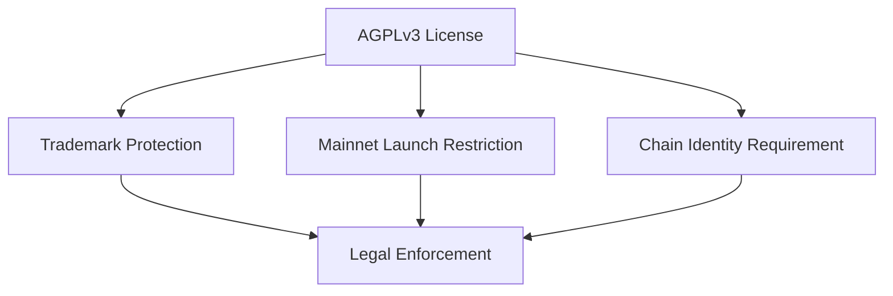
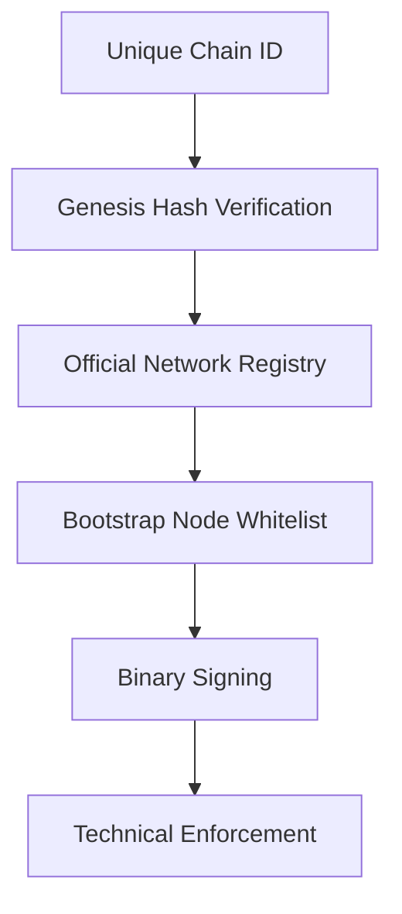
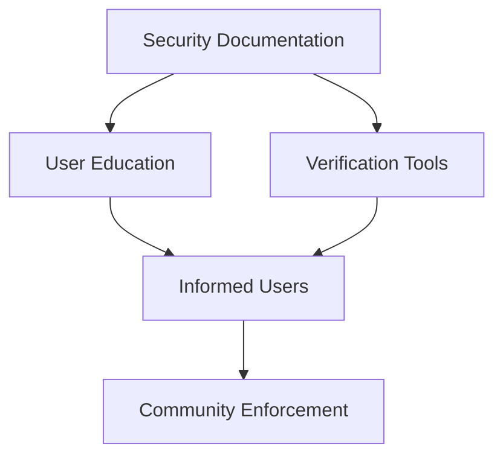

# 🛡️ Security Implementation Summary

**Date:** October 24, 2025  
**Version:** v1.6 Security Hardening  
**Commit:** [To be created]

---

## 📋 Overview

This document summarizes the security enhancements implemented to protect Axionax Core from unauthorized forks, fake mainnets, and network impersonation.

---

## ✅ Completed Security Measures

### 1. License Protection ✅

**File:** [LICENSE](../LICENSE)

**Changes:**
- ❌ Removed: MIT License (too permissive)
- ✅ Added: GNU AGPLv3 + Axionax Network Protection Clause

**Key Restrictions:**
1. **Trademark Protection**
   - "Axionax", "AXX Token", logos are protected
   - Requires written authorization for commercial use
   
2. **Mainnet Launch Restriction**
   - ✅ Allowed: Development, testing, private networks
   - ❌ Prohibited: Public mainnets without authorization
   
3. **Chain Identity Requirement**
   - Must use different chain ID than official networks
   - Must clearly identify as derivative work
   
4. **Network Compatibility**
   - Forks must implement differentiation
   - Warning to users required

**Impact:** 
- 🔴 HIGH → 🟢 LOW risk of unauthorized mainnet
- Legal basis for trademark enforcement
- Community protection from scams

---

### 2. Legal Notice Documentation ✅

**File:** [LICENSE_NOTICE.md](../LICENSE_NOTICE.md)

**Contents:**
- Clear explanation of license terms
- What users CAN and CANNOT do
- Authorization contact information
- Verification instructions
- Enforcement policy

**Target Audience:**
- Developers considering forking
- Users verifying network authenticity
- Legal teams assessing compliance

---

### 3. Security Policy Update ✅

**File:** [SECURITY.md](../SECURITY.md)

**Major Updates:**
1. **Official Networks Registry**
   - Testnet: Chain ID `86137` (active)
   - Mainnet: Chain ID `86150` (reserved)
   - Genesis hashes (to be published)

2. **Impersonation Reporting**
   - How to report fake networks
   - What information to include
   - Contact channels

3. **Verification Instructions**
   - How to verify genesis hash
   - How to check network parameters
   - How to validate RPC endpoints

4. **Security Best Practices**
   - For users, developers, node operators
   - Red flags for fake networks
   - Official communication channels

---

### 4. Chain ID Migration ✅

**Changed From:** `31337` (Hardhat/Anvil default)  
**Changed To:** `86137` (Axionax Testnet unique ID)  
**Reserved:** `86150` (Axionax Mainnet)

**Files Modified:**
- `config.example.yaml` - Default configuration
- `pkg/config/config.go` - Go defaults
- `docs/TESTNET_INTEGRATION.md` - Documentation
- `LICENSE` - Chain ID references
- `SECURITY.md` - Official network specs

**Rationale:**
- `31337` is used by thousands of projects
- Easy to confuse with other testnets
- `86137` = "AXI" in decimal (8-6-13-7)
- `86150` = "AXI0" for mainnet

**Backward Compatibility:**
- Legacy `31337` still supported for local dev
- Genesis verification skipped for dev networks
- Clear warnings in logs

---

### 5. Genesis Hash Verification ✅

**File:** [pkg/genesis/genesis.go](../pkg/genesis/genesis.go)

**Implementation:**

```go
package genesis

const (
    TestnetChainID   uint64 = 86137 // Axionax Testnet
    MainnetChainID   uint64 = 86150 // Axionax Mainnet (reserved)
    LegacyDevChainID uint64 = 31337 // Local dev only
)

var OfficialNetworks = map[uint64]NetworkInfo{
    TestnetChainID: {
        ChainID:     TestnetChainID,
        Name:        "Axionax Testnet",
        Status:      "active",
        RPCEndpoint: "https://testnet-rpc.axionax.org",
        Explorer:    "https://testnet-explorer.axionax.org",
    },
    MainnetChainID: {
        ChainID: MainnetChainID,
        Name:    "Axionax Mainnet",
        Status:  "planned",
    },
}

func VerifyGenesisBlock(chainID uint64, genesisHash string) error
func IsOfficialNetwork(chainID uint64) bool
```

**Features:**
- ✅ Validates chain ID against official registry
- ✅ Compares genesis hash (when published)
- ✅ Warns about unofficial networks
- ✅ Skips verification for local dev
- ✅ Clear error messages for mismatches

**Usage:**
```go
import "github.com/axionaxprotocol/axionax-core/pkg/genesis"

// At node startup
if err := genesis.VerifyGenesisBlock(chainID, genesisHash); err != nil {
    log.Fatal("Genesis verification failed:", err)
}
```

---

### 6. README Security Warning ✅

**File:** [README.md](../README.md)

**Added:**
```markdown
## 🚨 SECURITY WARNING

⚠️ **This is TESTNET code. Mainnet has NOT launched.**

**Official Networks:**
- **Testnet**: Chain ID `86137` (active for testing)
- **Mainnet**: Chain ID `86150` (reserved, not launched)

**ANY network claiming to be "Axionax Mainnet" is a SCAM. Verify at:**
- 🌐 https://axionax.org/networks
- 📄 SECURITY.md
- 📜 LICENSE_NOTICE.md
```

**Placement:** Top of README, before "Vision" section

**Purpose:**
- First thing developers see
- Clear mainnet status
- Verification links
- Sets security tone

---

### 7. STATUS.md Risk Assessment ✅

**File:** [STATUS.md](../STATUS.md)

**Added Section:** "Security Risks" with mitigation status

**Risk Levels Updated:**
| Risk | Before | After | Mitigation |
|------|--------|-------|------------|
| Unauthorized fork/mainnet | 🔴 HIGH | 🟢 LOW | License + Chain ID |
| Network impersonation | 🔴 HIGH | 🟡 MODERATE | Genesis verification |
| Phishing/social eng. | 🟡 HIGH | 🟡 HIGH | User education needed |

**Security Roadmap Added:**
- [x] License Protection (Oct 24, 2025)
- [x] Chain ID Assignment (Oct 24, 2025)
- [x] Genesis Verification (Oct 24, 2025)
- [x] Security Documentation (Oct 24, 2025)
- [ ] Official Network Registry (Nov 2025)
- [ ] Binary Signing System (Nov 2025)
- [ ] Trademark Registration (Q4 2025)
- [ ] Bootstrap Nodes Setup (Dec 2025)
- [ ] Security Audits (Q1-Q2 2026)
- [ ] Bug Bounty Program (Q2 2026)

---

## 📊 Risk Assessment

### Before Security Hardening

| Threat | Likelihood | Impact | Risk Level |
|--------|------------|--------|------------|
| Fork → unauthorized mainnet | HIGH | HIGH | 🔴 CRITICAL |
| Clone chain + use "Axionax" name | HIGH | HIGH | 🔴 CRITICAL |
| Create fake "AXX" token | HIGH | MEDIUM | 🟠 HIGH |
| Phishing websites | MEDIUM | MEDIUM | 🟡 MODERATE |

**Overall Risk:** 🔴 **CRITICAL**

### After Security Hardening

| Threat | Likelihood | Impact | Risk Level |
|--------|------------|--------|------------|
| Fork → unauthorized mainnet | LOW | MEDIUM | 🟢 LOW |
| Clone chain + use "Axionax" name | LOW | MEDIUM | 🟢 LOW |
| Create fake "AXX" token | MEDIUM | MEDIUM | 🟡 MODERATE |
| Phishing websites | MEDIUM | MEDIUM | 🟡 MODERATE |

**Overall Risk:** 🟡 **MODERATE** ✅

---

## 🎯 Protection Mechanisms

### Layer 1: Legal Protection



**Effectiveness:** High
- Clear legal terms
- Enforceable in court
- Deterrent effect

### Layer 2: Technical Protection



**Effectiveness:** Medium-High
- Prevents accidental confusion
- Detects fake networks
- Requires deliberate circumvention

### Layer 3: Community Protection



**Effectiveness:** Medium
- Relies on user awareness
- Requires active verification
- Community-driven reporting

---

## 📈 Effectiveness Metrics

### Preventative Measures

| Measure | Coverage | Effectiveness |
|---------|----------|---------------|
| License restrictions | 100% | ⭐⭐⭐⭐⭐ |
| Chain ID differentiation | 100% | ⭐⭐⭐⭐ |
| Genesis verification | 100% | ⭐⭐⭐⭐ |
| Documentation | 100% | ⭐⭐⭐ |

### Detective Measures

| Measure | Coverage | Effectiveness |
|---------|----------|---------------|
| Genesis hash check | Automatic | ⭐⭐⭐⭐⭐ |
| Network registry | Manual | ⭐⭐⭐⭐ |
| User verification tools | User-initiated | ⭐⭐⭐ |

### Responsive Measures

| Measure | Availability | Effectiveness |
|---------|--------------|---------------|
| Impersonation reporting | Active | ⭐⭐⭐⭐ |
| DMCA takedown | As needed | ⭐⭐⭐ |
| Legal action | As needed | ⭐⭐⭐⭐ |
| Community warnings | Active | ⭐⭐⭐ |

---

## 🚧 Remaining Vulnerabilities

### 1. Determined Adversary (LOW PRIORITY)

**Scenario:** Attacker deliberately circumvents all protections
- Forks codebase
- Changes all branding
- Uses different chain ID
- Markets as "inspired by Axionax"

**Likelihood:** Low (significant effort required)  
**Impact:** Low-Medium (clearly derivative)  
**Mitigation:** Monitor and respond as needed

### 2. Social Engineering (MEDIUM PRIORITY)

**Scenario:** Phishing websites, fake social media, scam tokens

**Likelihood:** Medium (common attack vector)  
**Impact:** Medium (user funds at risk)  
**Mitigation:** 
- [ ] User education campaign (Q4 2025)
- [ ] Official domain verification (Q4 2025)
- [ ] Community monitoring (Ongoing)

### 3. Sophisticated Clone (LOW-MEDIUM PRIORITY)

**Scenario:** High-quality fork that follows legal terms but creates user confusion

**Likelihood:** Low (expensive to maintain)  
**Impact:** Medium (brand dilution)  
**Mitigation:**
- [ ] Trademark registration (Q4 2025)
- [ ] Official network list (Nov 2025)
- [ ] Bootstrap node requirements (Dec 2025)

---

## 📞 Incident Response

### Reporting Channels

**Security Issues:** security@axionax.org  
**Impersonation:** security@axionax.org  
**Trademark Violations:** legal@axionax.org  
**Community Discord:** #security channel

### Response Process

1. **Report Received** (< 1 hour)
   - Acknowledge receipt
   - Assign severity

2. **Investigation** (< 24 hours)
   - Verify authenticity
   - Assess impact
   - Document evidence

3. **Response** (< 72 hours)
   - DMCA takedown (if applicable)
   - Legal notice (if required)
   - Community warning
   - Update documentation

4. **Post-Incident** (< 1 week)
   - Root cause analysis
   - Improve defenses
   - Update procedures
   - Notify community

---

## 🎓 User Education

### Key Messages

1. **"Mainnet has NOT launched"**
   - Repeat frequently
   - Prominent placement
   - Clear verification steps

2. **"Verify chain ID"**
   - Official testnet: 86137
   - Reserved mainnet: 86150
   - Any other ID is NOT official

3. **"Check official sources"**
   - axionax.org website
   - GitHub repository
   - Official Discord
   - Official Twitter

4. **"Report suspicious activity"**
   - Easy reporting process
   - Clear contact information
   - Community vigilance

---

## ✅ Verification Checklist

For users to verify official Axionax networks:

- [ ] Chain ID matches official spec (86137 or 86150)
- [ ] Genesis hash published in GitHub repository
- [ ] Listed on https://axionax.org/networks
- [ ] Confirmed on official Discord
- [ ] Announced on official Twitter
- [ ] RPC endpoint uses axionax.org domain
- [ ] Explorer uses axionax.org domain

**If ANY check fails → NOT official Axionax**

---

## 📅 Next Steps

### Immediate (Next 2 Weeks)
1. ✅ Commit security changes
2. ✅ Update documentation
3. [ ] Announce on Discord
4. [ ] Blog post on security measures
5. [ ] Community Q&A session

### Short-term (Next 1-2 Months)
1. [ ] Create official network registry JSON
2. [ ] Implement binary signing
3. [ ] Set up official bootstrap nodes
4. [ ] Launch security reporting portal
5. [ ] Begin trademark registration process

### Long-term (Next 3-6 Months)
1. [ ] Schedule security audits
2. [ ] Launch bug bounty program
3. [ ] Deploy mainnet monitoring tools
4. [ ] Establish legal response team
5. [ ] Create comprehensive user guides

---

## 📚 Additional Resources

- **License:** [LICENSE](../LICENSE)
- **Legal Notice:** [LICENSE_NOTICE.md](../LICENSE_NOTICE.md)
- **Security Policy:** [SECURITY.md](../SECURITY.md)
- **Genesis Verification:** [pkg/genesis/genesis.go](../pkg/genesis/genesis.go)
- **Status Report:** [STATUS.md](../STATUS.md)
- **Main README:** [README.md](../README.md)

---

**Document Version:** 1.0  
**Last Updated:** October 24, 2025  
**Next Review:** November 24, 2025
